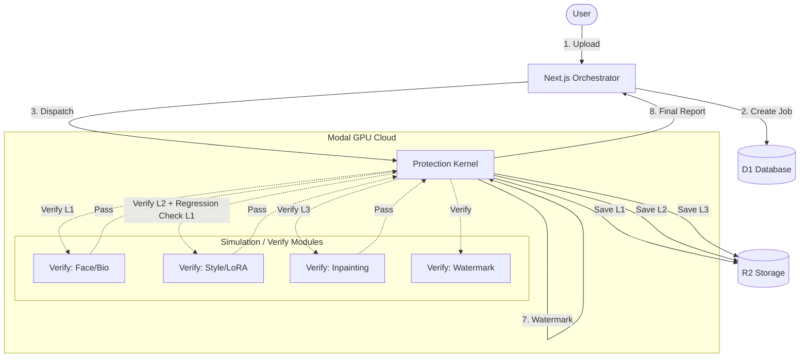

# Drimit Shield v2: Unified Pipeline Architecture

**Status:** Draft
**Date:** February 15, 2026
**Version:** 2.4.0 (Granular 5-Layer Pipeline)

---

## 1. System Overview: The 4-Layer Atomic Model

This architecture upgrades the pipeline to a fully granular **4-Layer Protection System**, responding to the need for specific "Anti-Deepfake", "Anti-Mimicry", and "Anti-Editing" visibility.

The system retains the **Atomic Save-Verify** model (v2.3), where every layer is applied, saved, and verified independently before moving to the next.

## 2. The 4 Layers of Defense

The "Anti-AI" monolith has been split into distinct atomic steps.

| Layer | Name | Target | Technique | Verification Metric |
| :--- | :--- | :--- | :--- | :--- |
| **L1** | **Anti-Deepfake** | **Identity/Face** | Biometric Disruption (Geometry/Warping) | **Face Detection Score:** Must be `< Threshold` |
| **L2** | **Anti-Mimicry** | **Style/Vibe** | Concept Poisoning (Mist/Glaze) | **Style Similarity:** Must be `< Threshold` |
| **L3** | **Anti-Editing** | **Manipulation** | Diffusion Immunization (Photoguard) | **Inpainting Resistance:** Artifacts in edited regions |
| **L4** | **Watermark** | **Ownership** | Invisible Steganography | **Bit Error Rate (BER):** Must be `< Threshold` |

## 3. The Lifecycle (Revised Loop)

## 4. Technical Implementation Details

### A. Separation of Concerns (L1 vs L2)
*   **Layer 1 (Deepfake)** focuses on *geometric* changes (Fawkes-method) or local pixel perturbation specifically on facial landmarks.
*   **Layer 2 (Mimicry)** focuses on *global* changes (Adversarial Noise) that disrupt latent feature extraction.
*   **Crucial:** L2 verification includes a **Regression Check**. It ensures that the global noise from L2 didn't accidentally "heal" the face protection from L1.

### B. Anti-Editing (L3)
*   This is distinct from Mimicry. While Mimicry prevents *training*, L3 prevents *inference* (img2img).
*   If a specific "Photoguard" encoder breaker is not available, L3 acts as a "Hardening" step that verifies the image against an automated inpainting attack.

### C. Data Consistency
*   The DB `steps` array will now contain 4 entries.
*   Each step has its own independently verifiable artifact in R2 (`checkpoint_l1_bio.png`, `checkpoint_l2_mimicry.png`, etc.), enabling granular debugging for the user.
