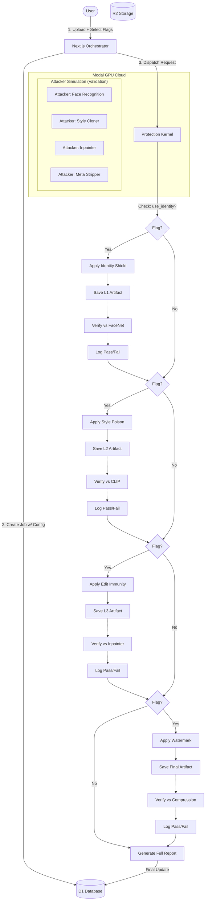

# Drimit v2: Architecture & Granular Pipeline

**Status:** Living Document
**Date:** February 17, 2026
**Version:** 2.5.0

---

## 1. System Overview

The Drimit architecture is a **Conditional, Atomic Pipeline**. Unlike a rigid assembly line, the protection kernel dynamically adapts to the user's security requirements.

### Key Constraints & Requirements
*   **User Control:** User provides specific flags (`use_identity`, `use_style`, etc.) at job creation.
*   **Conditional Execution:** Steps are skipped entirely (0 cost, 0 latency) if not requested.
*   **Atomic Validation:** A protection layer is never marked "Complete" until it has been saved to storage (R2) and successfully passed its specific adversarial validation module.

## 2. Updated Lifecycle (The "Select-Protect-Verify" Loop)



## 3. Data Schema Implications

The `config` JSON column in `artwork_jobs` and the request payload to Modal is the source of truth for the granular flags.

```typescript
// Modal Request Payload
{
  "image_url": "...",
  "config": {
    "intensity": "High"
  },
  // Granular Flags
  "use_identity_shield": true, // Vector C (Deepfakes)
  "use_style_poison": false,   // Vector B (Style Theft) - User disabled
  "use_edit_immunity": true,   // Vector A (Unauthorized Editing)
  "use_watermark": true        // Vector D (Attribution)
}
```

## 4. Validation Engine (Open Source Proxies)

We use high-performance Open Source models to approximate the capabilities of closed adversarial models.

| Risk Vector | Validation Proxy | Why this proxy? |
| :--- | :--- | :--- |
| **Identity Theft** | `FaceNet` / `MTCNN` | Standard for academic benchmarking of facial recognition. |
| **Style Theft** | `CLIP-ViT-Large` | Foundation metric for semantic similarity in Generative AI. |
| **Editing** | `Stable Diffusion Inpainting` | The most widely used open source editing engine. |
| **Attribution** | `DWT-DCT` + `JPEG-80` | Simulates standard social media compression algorithms. |
