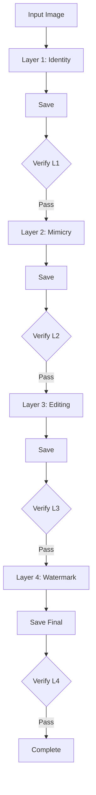

# Protection Engine: Atomic Kernel

**Status:** Active Development
**Date:** February 15, 2026
**Target:** `modal/protection`

---

## 1. Overview: Atomic Save-Then-Verify

The Protection Engine executes a strictly ordered pipeline where the asset is **saved to storage** before it is verified. This guarantees that the verification process tests the actual artifact that will be delivered to the user.

**The Flow:** `Protect -> Save -> Verify`

## 2. Architecture: The Kernel Cycle

The Kernel orchestrates the sub-modules. It manages the `layer_order` and ensures that if a layer is active, its corresponding verification runs immediately after saving.



## 3. Component Breakdown

### Layer 1: Identity (Anti-Deepfake)
*   **Action:** Biometric perturbation (Fawkes/LowKey style). Targets facial geometry.
*   **Verify (`verify_identity`):**
    *   **Test:** Face Detection & Recognition confidence.
    *   **Pass:** Faces < Threshold.

### Layer 2: Mimicry (Anti-Style)
*   **Action:** Style Poisoning (Glaze/Mist style). Targets latent style features.
*   **Verify (`verify_mimicry`):**
    *   **Test:** Style Transfer / Dreambooth simulation.
    *   **Pass:** CLIP Style Similarity < Threshold.

### Layer 3: Editing (Anti-Inpainting)
*   **Action:** Diffusion Immunization (Photoguard style). Targets local coherence.
*   **Verify (`verify_editing`):**
    *   **Test:** Automated Inpainting attack.
    *   **Pass:** Inpainted area is incoherent/noisy.

### Layer 4: The Identity (Watermark)
*   **Action:** Invisible Frequency Watermark.
*   **Verify (`verify_watermark`):**
    *   **Test:** Robustness (Compression/Crop).
    *   **Pass:** Payload matches input UUID.

## 4. Implementation Details

### Conditional Execution
The Kernel checks configuration before each step.
```python
if job.config.enable_identity:
    # ...
if job.config.enable_mimicry:
    # ...
```

### Data Persistence
*   **Verification Data:** The result of each `verify_X` call (JSON) is appended to the job's `history` log in the database immediately.
*   **Artifacts:** We keep all intermediate steps (`layer1`, `layer2`) for debugging purposes, though only `final` is presented to the end user by default.
